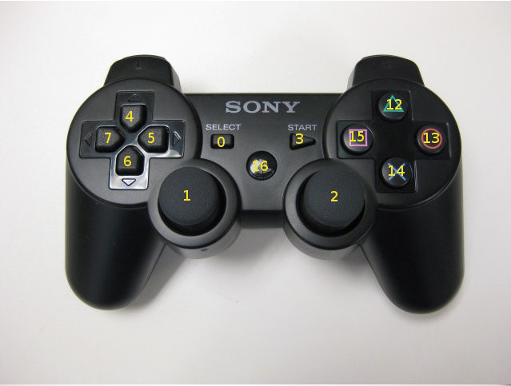
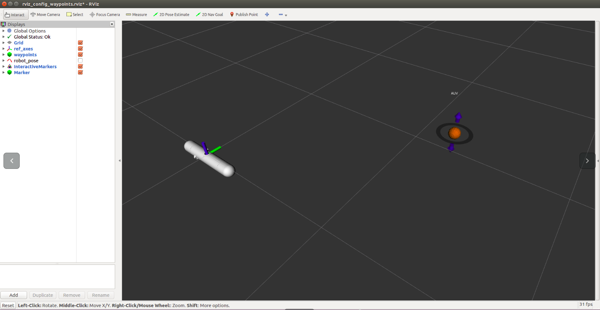
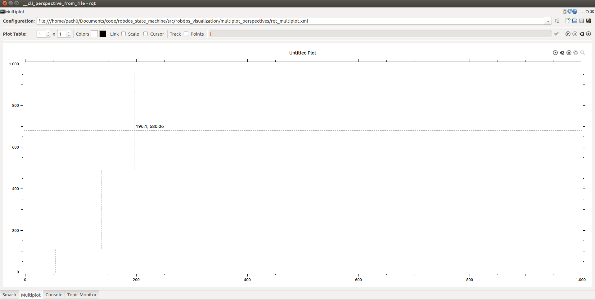
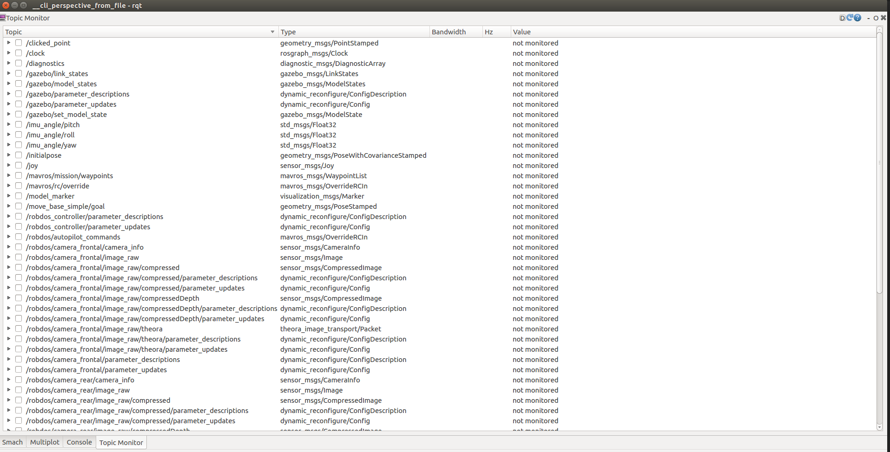

Robdos Architecture
===================

This section explains how the code is structured and the usefulness of the
interfaces that you can see when you launch the code.

So as to be able to understand and see the code, you must follow the steps 
explained in the previous section.

Code Structure
^^^^^^^^^^^^^^

1. **Robdos Autonomous**

It includes the control of the AUV. It is used in both the real robot and the the simulates one.
The inputs that we receive so that we can control the robot are: Odometry (Position and 
Orientation) and the waypoint desired. Last, it is important to mentioned that the linear and
angular movement are done at the same time.

2. **Robdos Dependancies**

This package includes the dependancies (usb_cam, mavros, ...) necessary to compile the project. 
This package has been done in the case one of the packages gets upgraded and, this impedes us to
be able to compile the project.

3. **Robdos Dynamics**

This is a package that we use in our as an alternative to the plugin to Gazebo that I will explain 
later. It receives the velocities we are sending to the thrusters of the submarine, transforms them 
to the forces and determines the position of the robot. Then, the node sends the position to Gazebo 
and it represents it.

4. **Robdos Safety**

This package checks all sensors from the AUV and acts in consequence of the value of those sensors.
The sensors it reads are humidity, temperature and battery.

5. **Robdos Sim**

6. **Robdos State Machine**

This package includes the state machine that has been done with the tool Smach. We can move through 
the different states, depending on the mission we want to do. 

7. **Robdos Station**

It shows a graphical user interface (GUI) that reads the value of the topics and monitors some of them.

8. **Robdos Teleop**

It converts the input of the joy into the input of the PixHawk. The buttoms we must press are mentioned 
above.

9. **Robdos Utils**

10. **Robdos Vision**

11. **Robdos Visualization**

Code format
^^^^^^^^^^^

So as to be able to have an standardized code, we must follow the rules mentioned in:

http://wiki.ros.org/PyStyleGuide

http://wiki.ros.org/CppStyleGuide

In addition, we have to:

* Name topics as with /robdos/NameTopic
* Start package names with robdos

Joy
^^^

http://wiki.ros.org/ps3joy

The possible commands we can use to control the robot are:

+-------------------------------------+--------------------------------------+
|Buttoms                              |Consequence                           |
+=====================================+======================================+
|3+                                   |Forward                               |
+-------------------------------------+--------------------------------------+
|3-                                   |Backward                              |
+-------------------------------------+--------------------------------------+
|0+                                   |Yaw clockwise                         |
+-------------------------------------+--------------------------------------+
|0-                                   |Yaw anti-clockwise                    |
+-------------------------------------+--------------------------------------+
|10 & 14                              |Arm                                   |
+-------------------------------------+--------------------------------------+
|10 & 15                              |Disarm                                |
+-------------------------------------+--------------------------------------+
|10 & 12                              |Change teleop                         |
+-------------------------------------+--------------------------------------+
|8 & 9                                |Change semiautonomous                 |
+-------------------------------------+--------------------------------------+

Interfaces
^^^^^^^^^^

.. image:: ../images/Smach.png
    :width: 1000px
    :align: center
    :height: 500px
    :alt: alternate text

.. image:: ../images/Gazebo.png
    :width: 1000px
    :align: center
    :height: 500px
    :alt: alternate text

Launch files
^^^^^^^^^^^^

The launch available in the code are:

+-------------------------------------+--------------------------------------+
|Launch                               |Package                               |
+=====================================+======================================+
|robdos_autonomous.launch             |robdos_autonomous                     |
+-------------------------------------+--------------------------------------+
|None                                 |robdos_dependancies                   |
+-------------------------------------+--------------------------------------+
|robdos_dynamics.launch               |robdos_dynamics                       |
+-------------------------------------+                                      +
|robdos_dynamics_tests.launch         |                                      |
+-------------------------------------+--------------------------------------+
|robdos_safety.launch                 |robdos_safety                         |
+-------------------------------------+--------------------------------------+
|robdos_gazebo_dynamics.launch        |robdos_sim                            |
+-------------------------------------+                                      +
|robdos_simulated_dynamics.launch     |                                      |
+-------------------------------------+--------------------------------------+
|ground_architecture.launch           |robdos_state_machine                  |
+-------------------------------------+                                      +
|on_board_architecture.launch         |                                      |
+-------------------------------------+                                      +
|robdos_state_machine.launch          |                                      |
+-------------------------------------+                                      +
|simulation_ground_architecture.launch|                                      |
+-------------------------------------+--------------------------------------+
|robdos_ground.launch                 |robdos_station                        |
+-------------------------------------+--------------------------------------+
|robdos_teleop.launch                 |robdos_teleop                         |
+-------------------------------------+--------------------------------------+
|None                                 |robdos_utils                          |
+-------------------------------------+--------------------------------------+
|robdos_vision_cpp.launch             |robdos_vision                         |
+-------------------------------------+                                      +
|robdos_vision_py.launch              |                                      |
+-------------------------------------+--------------------------------------+
|robdos_presentation_demo.launch      |robdos_visualization                  |
+-------------------------------------+--------------------------------------+

The ones that we use in order to simulate or control the real robot are:

* Simulated robot:

.. code-block:: none

    robdos_gazebo_dynamics.launch
    robdos_simulated_dynamics.launch

* Real Robot:

List of topics 
^^^^^^^^^^^^^^

Topics of the PixHawk:

+------------------------------------+--------------------------------------+
|Topics                              |msg                                   |
+====================================+======================================+
|/mavlink/from                       |mavros_msgs::Mavlink                  |
+------------------------------------+--------------------------------------+
|/mavlink/to                         |mavros_msgs::Mavlink                  |
+------------------------------------+--------------------------------------+
|/mavros/battery                     |mavros__msgs::BatteryStatus           |
+------------------------------------+--------------------------------------+
|/mavros/cam_imu_sync/cam_imu_stamp  |mavros__msgs::CamIMUStamp             |
+------------------------------------+--------------------------------------+
|/mavros/extended_state              |mavros__msgs::ExtendedState           |
+------------------------------------+--------------------------------------+
|/mavros/global_position/compass_hdg |std_msgs::Float64                     |
+------------------------------------+--------------------------------------+
|/mavros/global_position/global      |sensor_msgs::NavSatFix                |
+------------------------------------+--------------------------------------+
|/mavros/global_position/local       |nav_msgs::Odometry                    |
+------------------------------------+--------------------------------------+
|/mavros/global_position/raw/fix     |sensor_msgs::NavSatFix                |
+------------------------------------+--------------------------------------+
|/mavros/global_position/raw/gps_vel |geometry_msgs::TwistStamped           |
+------------------------------------+--------------------------------------+
|/mavros/global_position/rel_alt     |std_msgs::Float64                     |
+------------------------------------+--------------------------------------+
|/mavros/hil_controls/hil_controls   |mavros__msgs::HilControls             |
+------------------------------------+--------------------------------------+
|/mavros/imu/atm_pressure            |sensor_msgs::FluidPressure            |
+------------------------------------+--------------------------------------+
|/mavros/imu/data                    |sensor_msgs::Imu                      |
+------------------------------------+--------------------------------------+
|/mavros/imu/data_raw                |sensor_msgs::Imu                      |
+------------------------------------+--------------------------------------+
|/mavros/imu/mag                     |sensor_msgs::MagneticField            |
+------------------------------------+--------------------------------------+
|/mavros/imu/temperature             |sensor_msgs::Temperature              |
+------------------------------------+--------------------------------------+
|/mavros/local_position/odom         |nav_msgs::Odometry                    |
+------------------------------------+--------------------------------------+
|/mavros/local_position/pose         |geometry_msgs::PoseStamped            |
+------------------------------------+--------------------------------------+
|/mavros/local_position/velocity     |geometry_msgs::TwistStamped           |
+------------------------------------+--------------------------------------+
|/mavros/manual_control/control      |mavros__msgs::ManualControl           |
+------------------------------------+--------------------------------------+
|/mavros/mission/waypoints           |mavros_msgs::WaypointList             |
+------------------------------------+--------------------------------------+
|/mavros/radio_status                |mavros__msgs::RadioStatus             |
+------------------------------------+--------------------------------------+
|/mavros/rc/in                       |mavros__msgs::RCIn                    |
+------------------------------------+--------------------------------------+
|/mavros/rc/out                      |mavros__msgs::RCOut                   |
+------------------------------------+--------------------------------------+
|/mavros/rc/override                 |mavros_msgs::OverrideRCIn             |
+------------------------------------+--------------------------------------+
|/mavros/setpoint_accel/accel        |geometry_msgs::Vector3Stamped         |
+------------------------------------+--------------------------------------+
|/mavros/setpoint_position/local     |geometry_msgs::PoseStamped            |
+------------------------------------+--------------------------------------+
|/mavros/setpoint_raw/attitude       |mavros__msgs::AttitudeTarget          |
+------------------------------------+--------------------------------------+
|/mavros/setpoint_raw/global         |mavros__msgs::GlobalPositionTarget    |
+------------------------------------+--------------------------------------+
|/mavros/setpoint_raw/local          |mavros__msgs::PositionTarget          |
+------------------------------------+--------------------------------------+
|/mavros/setpoint_raw/target_attitude|mavros__msgs::AttitudeTarget          |
+------------------------------------+--------------------------------------+
|/mavros/setpoint_raw/target_global  |mavros__msgs::PositionTarget          |
+------------------------------------+--------------------------------------+
|/mavros/setpoint_raw/target_local   |mavros__msgs::PositionTarget          |
+------------------------------------+--------------------------------------+
|/mavros/setpoint_velocity/cmd_vel   |geometry_msgs::TwistStamped           |
+------------------------------------+--------------------------------------+
|/mavros/state                       |mavros__msgs::State                   |
+------------------------------------+--------------------------------------+
|/mavros/time_reference              |sensor_msgs::TimeReference            |
+------------------------------------+--------------------------------------+
|/mavros/vfr_hud                     |mavros__msgs::VFR_HUD                 |
+------------------------------------+--------------------------------------+
|/mavros/wind_estimation             |geometry_msgs::TwistStamped           |
+------------------------------------+--------------------------------------+

Othe topics: 

+------------------------------------+--------------------------------------+
|               Topics               |                 msg                  |
+====================================+======================================+
|/diagnostics                        |diagnostic_msgs::DiagnosticArray      |
+------------------------------------+--------------------------------------+
|/joy                                |sensor_msgs::Joy                      |
+------------------------------------+--------------------------------------+
|/rosout                             |rosgraph_msgs::Log                    |
+------------------------------------+--------------------------------------+
