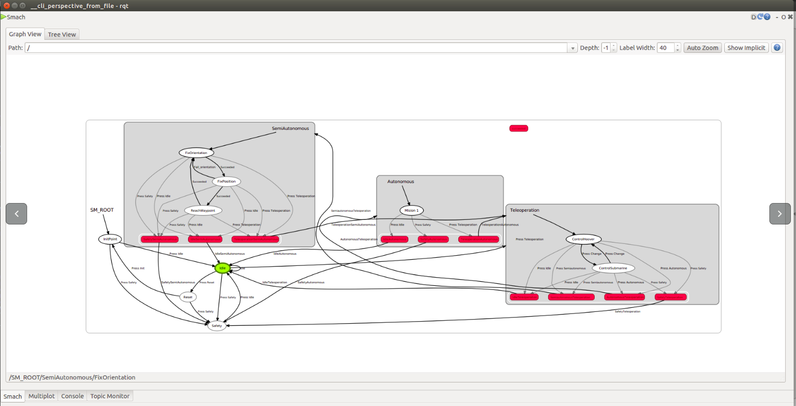
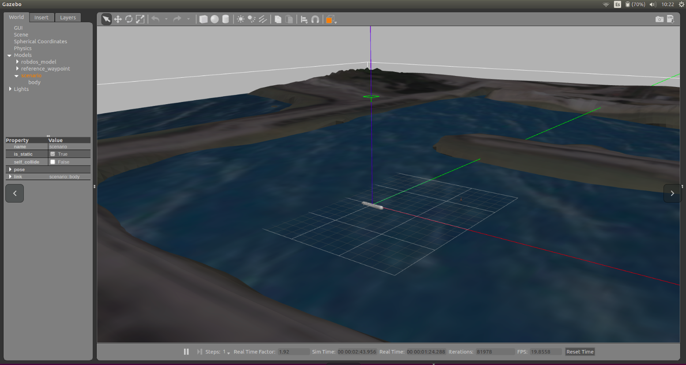

Robdos Architecture
===================

This section explains how the code is structured and the usefulness of the
interfaces that you can see when you launch the code.

So as to be able to understand and see the code, you must follow the steps 
explained in the previous section.

Code Structure
^^^^^^^^^^^^^^

Code format
^^^^^^^^^^^

Interfaces
^^^^^^^^^^

.. image:: ../images/RViz.png
    :width: 1000px
    :align: center
    :height: 500px
    :alt: alternate text

Launch files
^^^^^^^^^^^^

The launch available in the code are:

+-------------------------------------+--------------------------------------+
|Launch                               |Package                               |
+=====================================+======================================+
|robdos_autonomous.launch             |robdos_autonomous                     |
+-------------------------------------+--------------------------------------+
|None                                 |robdos_dependancies                   |
+-------------------------------------+--------------------------------------+
|robdos_dynamics.launch               |robdos_dynamics                       |
+-------------------------------------+                                      +
|robdos_dynamics_tests.launch         |                                      |
+-------------------------------------+--------------------------------------+
|robdos_safety.launch                 |robdos_safety                         |
+-------------------------------------+--------------------------------------+
|robdos_gazebo_dynamics.launch        |robdos_sim                            |
+-------------------------------------+                                      +
|robdos_simulated_dynamics.launch     |                                      |
+-------------------------------------+--------------------------------------+
|ground_architecture.launch           |robdos_state_machine                  |
+-------------------------------------+                                      +
|on_board_architecture.launch         |                                      |
+-------------------------------------+                                      +
|robdos_state_machine.launch          |                                      |
+-------------------------------------+                                      +
|simulation_ground_architecture.launch|                                      |
+-------------------------------------+--------------------------------------+
|robdos_ground.launch                 |robdos_station                        |
+-------------------------------------+--------------------------------------+
|robdos_teleop.launch                 |robdos_teleop                         |
+-------------------------------------+--------------------------------------+
|None                                 |robdos_utils                          |
+-------------------------------------+--------------------------------------+
|robdos_vision_cpp.launch             |robdos_vision                         |
+-------------------------------------+                                      +
|robdos_vision_py.launch              |                                      |
+-------------------------------------+--------------------------------------+
|robdos_presentation_demo.launch      |robdos_visualization                  |
+-------------------------------------+--------------------------------------+

The ones that we use in order to simulate or control the real robot are:

* Simulated robot:

.. code-block:: none

    robdos_gazebo_dynamics.launch
    robdos_simulated_dynamics.launch

* Real Robot:

List of topics 
^^^^^^^^^^^^^^

Topics of the PixHawk:

+------------------------------------+--------------------------------------+
|Topics                              |msg                                   |
+====================================+======================================+
|/mavlink/from                       |mavros_msgs::Mavlink                  |
+------------------------------------+--------------------------------------+
|/mavlink/to                         |mavros_msgs::Mavlink                  |
+------------------------------------+--------------------------------------+
|/mavros/battery                     |mavros__msgs::BatteryStatus           |
+------------------------------------+--------------------------------------+
|/mavros/cam_imu_sync/cam_imu_stamp  |mavros__msgs::CamIMUStamp             |
+------------------------------------+--------------------------------------+
|/mavros/extended_state              |mavros__msgs::ExtendedState           |
+------------------------------------+--------------------------------------+
|/mavros/global_position/compass_hdg |std_msgs::Float64                     |
+------------------------------------+--------------------------------------+
|/mavros/global_position/global      |sensor_msgs::NavSatFix                |
+------------------------------------+--------------------------------------+
|/mavros/global_position/local       |nav_msgs::Odometry                    |
+------------------------------------+--------------------------------------+
|/mavros/global_position/raw/fix     |sensor_msgs::NavSatFix                |
+------------------------------------+--------------------------------------+
|/mavros/global_position/raw/gps_vel |geometry_msgs::TwistStamped           |
+------------------------------------+--------------------------------------+
|/mavros/global_position/rel_alt     |std_msgs::Float64                     |
+------------------------------------+--------------------------------------+
|/mavros/hil_controls/hil_controls   |mavros__msgs::HilControls             |
+------------------------------------+--------------------------------------+
|/mavros/imu/atm_pressure            |sensor_msgs::FluidPressure            |
+------------------------------------+--------------------------------------+
|/mavros/imu/data                    |sensor_msgs::Imu                      |
+------------------------------------+--------------------------------------+
|/mavros/imu/data_raw                |sensor_msgs::Imu                      |
+------------------------------------+--------------------------------------+
|/mavros/imu/mag                     |sensor_msgs::MagneticField            |
+------------------------------------+--------------------------------------+
|/mavros/imu/temperature             |sensor_msgs::Temperature              |
+------------------------------------+--------------------------------------+
|/mavros/local_position/odom         |nav_msgs::Odometry                    |
+------------------------------------+--------------------------------------+
|/mavros/local_position/pose         |geometry_msgs::PoseStamped            |
+------------------------------------+--------------------------------------+
|/mavros/local_position/velocity     |geometry_msgs::TwistStamped           |
+------------------------------------+--------------------------------------+
|/mavros/manual_control/control      |mavros__msgs::ManualControl           |
+------------------------------------+--------------------------------------+
|/mavros/mission/waypoints           |mavros_msgs::WaypointList             |
+------------------------------------+--------------------------------------+
|/mavros/radio_status                |mavros__msgs::RadioStatus             |
+------------------------------------+--------------------------------------+
|/mavros/rc/in                       |mavros__msgs::RCIn                    |
+------------------------------------+--------------------------------------+
|/mavros/rc/out                      |mavros__msgs::RCOut                   |
+------------------------------------+--------------------------------------+
|/mavros/rc/override                 |mavros_msgs::OverrideRCIn             |
+------------------------------------+--------------------------------------+
|/mavros/setpoint_accel/accel        |geometry_msgs::Vector3Stamped         |
+------------------------------------+--------------------------------------+
|/mavros/setpoint_position/local     |geometry_msgs::PoseStamped            |
+------------------------------------+--------------------------------------+
|/mavros/setpoint_raw/attitude       |mavros__msgs::AttitudeTarget          |
+------------------------------------+--------------------------------------+
|/mavros/setpoint_raw/global         |mavros__msgs::GlobalPositionTarget    |
+------------------------------------+--------------------------------------+
|/mavros/setpoint_raw/local          |mavros__msgs::PositionTarget          |
+------------------------------------+--------------------------------------+
|/mavros/setpoint_raw/target_attitude|mavros__msgs::AttitudeTarget          |
+------------------------------------+--------------------------------------+
|/mavros/setpoint_raw/target_global  |mavros__msgs::PositionTarget          |
+------------------------------------+--------------------------------------+
|/mavros/setpoint_raw/target_local   |mavros__msgs::PositionTarget          |
+------------------------------------+--------------------------------------+
|/mavros/setpoint_velocity/cmd_vel   |geometry_msgs::TwistStamped           |
+------------------------------------+--------------------------------------+
|/mavros/state                       |mavros__msgs::State                   |
+------------------------------------+--------------------------------------+
|/mavros/time_reference              |sensor_msgs::TimeReference            |
+------------------------------------+--------------------------------------+
|/mavros/vfr_hud                     |mavros__msgs::VFR_HUD                 |
+------------------------------------+--------------------------------------+
|/mavros/wind_estimation             |geometry_msgs::TwistStamped           |
+------------------------------------+--------------------------------------+

Othe topics: 

+------------------------------------+--------------------------------------+
|               Topics               |                 msg                  |
+====================================+======================================+
|/diagnostics                        |diagnostic_msgs::DiagnosticArray      |
+------------------------------------+--------------------------------------+
|/joy                                |sensor_msgs::Joy                      |
+------------------------------------+--------------------------------------+
|/rosout                             |rosgraph_msgs::Log                    |
+------------------------------------+--------------------------------------+
